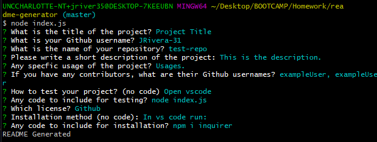

# Good README Generator


This app was created to provide a template for readme files. The user answers questions for what to include in the readme and a markdown file is created based on the project title. The user can choose what they want to include in the readme and then the file that is generate if they are not completely happy. This app is useful in reducing the amount of time taken on creating README files. 

## Table of Contents
-[Installation](#installation)

-[Usage](#usage)

-[Credits](#credits)

-[Test](#test)

## Installation:

**How to install the project:** You will need inquirer

```
npm i inquirer
```

## Usage:

Anyone can use to generate README files for your projects.

## Credits:

**Credits to contributors:** N/A

## Test:

**How to test the project:** Run VSCode

```
node index.js
```


